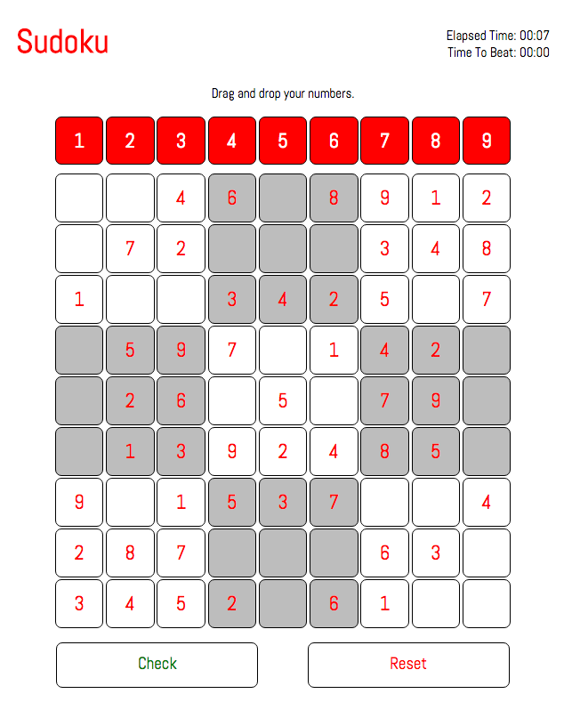

# Sudoku

My reproduction of the popular game Sudoku; a logic-based, combinatorial, number-placement puzzle. The objective is to fill a 9×9 grid with digits so that each column, each row, and each of the nine 3×3 sub-grids that compose the grid contains all of the digits from 1 to 9. 

### [Play Here!](http://j47lee.github.io/Sudoku/ "Sudoku")

##Technologies

- HTML/CSS/SASS
- JavaScript
- jQuery UI